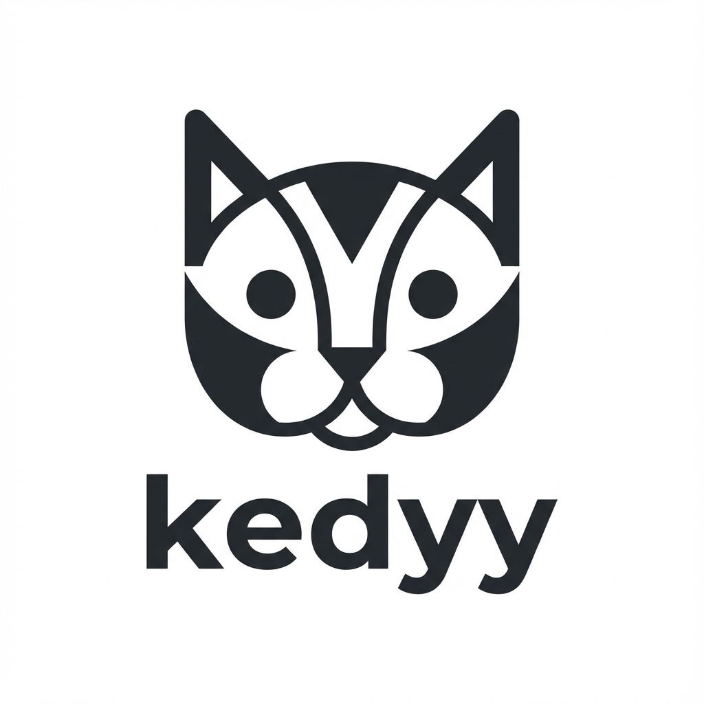

# kedyy 🐾

**kedyy**, tarayıcınıza eşlik eden sevimli bir arkadaş getirir. Yeni sekmenizde ve gezindiğiniz sayfalarda size eşlik eden animasyonlu kediler ile internet deneyiminizi daha eğlenceli hale getirin.



## ✨ Özellikler

- **Yeni Sekme Deneyimi:** Her yeni sekme açtığınızda sizi karşılayan sevimli kedi animasyonları.
- **Sayfa Arkadaşı:** Web sayfalarında gezindiğiniz sırada size eşlik eden interaktif öğeler.
- **Hafif ve Hızlı:** Lottie animasyonları sayesinde düşük kaynak tüketimi ve yüksek performans.
- **Tüm Tarayıcılarla Uyumlu:** Chrome, Firefox, Edge, Brave ve daha fazlasını destekler.

## 🚀 Kurulum

### Tarayıcı Mağazalarından (Önerilen)

*Yakında eklenecek...*

### Manuel Kurulum (Geliştiriciler İçin)

#### Chrome, Edge, Brave, Opera

1. [Releases](https://github.com/Softweal/kedyy/releases) sayfasından en son `kedyy-chrome-vx.x.x.zip` dosyasını indirin ve dışarı çıkarın.
2. Tarayıcınızda `chrome://extensions` adresine gidin.
3. Sağ üst köşedeki **Geliştirici Modu**'nu aktif hale getirin.
4. **Paketlenmemiş öğe yükle** butonuna tıklayın ve çıkardığınız klasörü seçin.

#### Firefox

1. [Releases](https://github.com/Softweal/kedyy/releases) sayfasından en son `kedyy-firefox-vx.x.x.zip` dosyasını indirin ve dışarı çıkarın.
2. Firefox'ta `about:debugging#/runtime/this-firefox` adresine gidin.
3. **Geçici Eklenti Yükle** butonuna tıklayın ve klasör içindeki `manifest.json` dosyasını seçin.

## 🛠️ Geliştirme

Projeyi yerel ortamda çalıştırmak için:

1. Depoyu klonlayın: `git clone https://github.com/Softweal/kedyy.git`
2. Dosyaları düzenleyin.
3. Değişiklikleri görmek için eklentiyi tarayıcıda yenileyin.

## 📦 Build ve Release

Bu proje GitHub Actions ile otomatik paketleme kullanır. Bir sürüm yayınlamak için:

1. `manifest.json` içindeki versiyonu güncelleyin.
2. Yeni bir tag oluşturun ve gönderin:

   ```bash
   git tag v1.0.5
   git push origin v1.0.5
   ```

GitHub Actions otomatik olarak `dist` klasörünü hazırlayacak ve Release sayfasına yükleyecektir.

## 📄 Lisans

Bu proje **MIT** lisansı ile lisanslanmıştır. Daha fazla bilgi için `LICENSE` dosyasına (varsa) bakabilirsiniz.

---
Yapan: [Emre Kayık](https://github.com/emrekayik) 🐾

